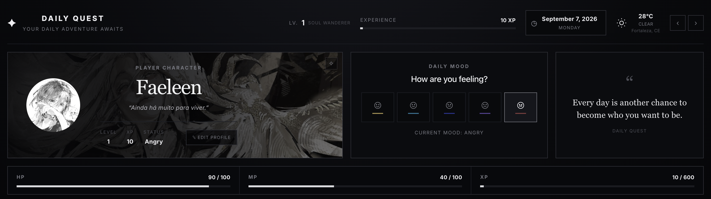
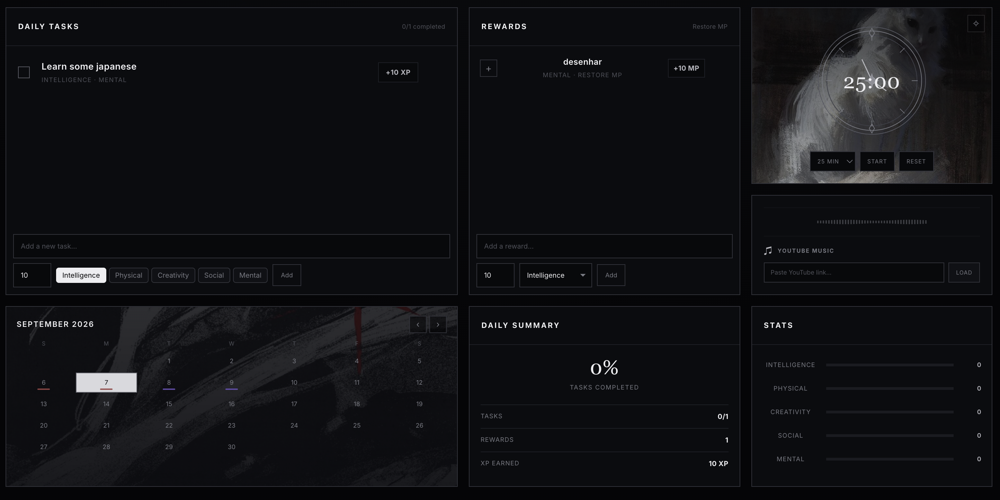

# ⚔ Daily Quest

> A dark gamified daily planner that combines everyday productivity with RPG-style progression.

[✦ Open Interactive Demo](https://mari-ww.github.io/daily-quest/demo/)

Daily Quest is a full-stack web application designed to turn daily planning into a small RPG experience.

Users organize their day through tasks, activities, and personal goals while completing them affects RPG-inspired resources such as HP, Mana, XP, Levels, and Stats.

The project was built as a portfolio application, with an emphasis on practical full-stack development, clear data flow, and a distinctive dark fantasy-inspired interface.

---

## ✨ Features

### ⚔️ Daily Tasks

Create and manage daily tasks with:

- Title
- Scheduled time
- XP reward
- Important task status
- Associated character stats
- Completion tracking

Completing tasks contributes to the user's daily progression.

### 🧪 Mana Activities

Activities represent optional actions such as rest, hobbies, or other rewarding moments.

Each activity can provide:

- Mana
- A selected character stat reward
- Completion tracking

Completing an activity restores Mana and contributes to the selected stat.

### ❤️ HP System

Important tasks are connected to the daily HP system.

The application tracks the user's HP throughout the day, creating a simple consequence/reward mechanic around completing important tasks.

### ✦ XP & Level Progression

Completed tasks provide XP and contribute to the user's character progression.

The application calculates the current level based on accumulated XP.

### 📊 Character Stats

Daily Quest tracks five RPG-inspired stats:

- Intelligence
- Physical
- Creativity
- Social
- Mental

Monthly stat progress is calculated from completed tasks and completed activities.

### 🌙 Mood Tracker

Users can record their mood for each day using a set of visual mood states.

Mood history is displayed through the calendar.

### 📅 Calendar

The calendar provides an overview of the month and displays daily information such as:

- Mood
- Daily progress
- Selected date

Users can navigate between dates and manage the planner for each day.

### ⏱️ Focus Timer

A built-in focus timer allows users to work in focused sessions without leaving the application.

The timer supports customizable durations and visual progress feedback.

### 🎵 YouTube Music

Users can load a YouTube video directly into the application and use it as background music while planning or working.

### 🎨 Personalization

The interface supports visual customization, including:

- Custom avatar
- Avatar background
- Calendar background
- Quote background
- Focus clock background

Background images use overlays to preserve readability while maintaining the visual style of the application.

### 🎉 Daily Completion Celebration

When all tasks for the selected day are completed, Daily Quest triggers a custom celebration animation with monochrome symbols rising from the bottom edges of the screen.

---

## 🖥️ Demo

### Live Demo

[Open the interactive demo](https://mari-ww.github.io/daily-quest/demo/)

> This is a static visual demo created to provide a quick preview of the application's interface and user experience.

---

## 📸 Preview





---

## 🛠️ Tech Stack

### Frontend

- React
- TypeScript
- Vite
- CSS

### Backend

- Python
- FastAPI
- SQLAlchemy
- Alembic
- PostgreSQL

### Infrastructure

- Docker
- Docker Compose

### Development

- Git
- GitHub
- Pytest

---

## 🏗️ Architecture

The application is divided into a frontend and backend that communicate through a REST API.

```text
┌──────────────────────┐
│      React App       │
│    TypeScript/Vite   │
└──────────┬───────────┘
           │
           │ REST API
           ▼
┌──────────────────────┐
│      FastAPI         │
│       Backend        │
└──────────┬───────────┘
           │
           ▼
┌──────────────────────┐
│     PostgreSQL       │
│      Database        │
└──────────────────────┘
```

The backend is organized around API routers, services, models, schemas, and database migrations.

The frontend handles planner state, API communication, daily interactions, personalization, and the visual RPG-inspired interface.

---

## 📁 Project Structure

```text
daily-quest/
│
├── backend/
│   ├── app/
│   │   ├── models/
│   │   ├── routers/
│   │   ├── schemas/
│   │   └── services/
│   │
│   └── tests/
│
├── frontend/
│   └── src/
│       ├── api/
│       ├── types/
│       ├── App.tsx
│       └── App.css
│
├── demo/
│   ├── index.html
│   ├── demo.js
│   └── demo.css
│
├── docker-compose.yml
├── README.md
└── ...
```

---

## ⚙️ How It Works

### Creating a Task

A user creates a daily task and can assign:

- An XP reward
- One or more character stats
- An important-task status

The task is associated with the selected daily entry.

### Completing a Task

When a task is completed, the backend updates its completion state and applies the corresponding gamification logic.

```text
Task completed
      ↓
Update task state
      ↓
Apply progression
      ↓
Update daily information
      ↓
Refresh monthly statistics
```

### Completing an Activity

Activities restore Mana when completed and contribute to their selected character stat.

```text
Activity completed
        ↓
Restore Mana
        ↓
Increase selected stat progress
        ↓
Update daily entry
```

### Monthly Statistics

The statistics endpoint aggregates tasks and activities across the selected month.

Task progress is calculated from the number of completed tasks associated with each stat, while completed activities provide additional stat progress.

```text
Monthly entries
      ↓
Find associated tasks
      ↓
Group tasks by stat
      ↓
Calculate completion progress
      ↓
Add completed activity rewards
      ↓
Return monthly stat progress
```

### Daily Completion Celebration

When the final incomplete task is completed, the frontend detects that all tasks for the selected day are complete and triggers the celebration animation.

The animation uses lightweight CSS and React rendering without an external animation library.

---

## 🚀 Running Locally

### Requirements

Make sure you have installed:

- Docker
- Docker Compose
- Node.js
- npm

### Clone the repository

```bash
git clone https://github.com/mari-ww/daily-quest.git
cd daily-quest
```

### Start the application

```bash
docker compose up --build
```

The application will start the required services using Docker Compose.

### Frontend

The frontend can then be accessed through the local development address configured by the project.

### API Documentation

FastAPI provides interactive API documentation through Swagger UI.

```text
/docs
```

---

## 🧪 Testing

The backend includes automated tests using Pytest.

Run the backend tests with:

```bash
pytest
```

The tests cover important application behavior, including gamification logic and API functionality.

---

## 🧠 What I Learned

Building Daily Quest helped me practice several aspects of full-stack application development:

- Designing a REST API with FastAPI
- Structuring backend logic around services and routers
- Working with PostgreSQL and SQLAlchemy
- Managing database changes with Alembic
- Building a React + TypeScript application
- Managing frontend API communication and asynchronous state
- Designing a gamification system around real application data
- Calculating monthly statistics from relational data
- Implementing date-based planner behavior
- Building interactive UI states with React
- Using CSS for custom animations and visual effects
- Using Docker to manage the development environment
- Designing a cohesive interface around a specific user experience

---

## 🎨 Design

The interface was designed around a dark fantasy / RPG-inspired productivity aesthetic.

The visual language uses:

- Dark backgrounds
- High-contrast typography
- Thin borders
- Monochrome decorative elements
- Subtle gradients and shadows
- Minimal accent colors
- RPG-inspired progression indicators

The goal is to make everyday planning feel more like managing a character's daily progression than using a traditional productivity application.

---

## 📌 Future Improvements

Possible future improvements include:

- [ ] User authentication
- [ ] Persistent user profiles
- [ ] More detailed character progression
- [ ] Achievement system
- [ ] Task streaks
- [ ] Weekly statistics
- [ ] More customization options
- [ ] Mobile-responsive improvements
- [ ] Deploy the full-stack application
- [ ] Cloud-based image storage

---

## 👩‍💻 Author

**Mariana**

Computer Science graduate focused on building practical full-stack applications with Python, React, and TypeScript.

---

## 📄 License

This project was created as a personal portfolio project.